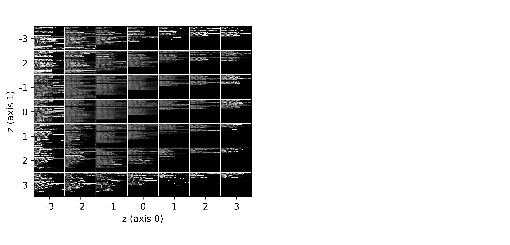

# Variational Autoencoder Network
Variational Autoencoder Network (**VAEN**) implementation on IMTD17 datasets to realize traffic identification.

## Introduction
3 files are available in this repository: 

| File Name  | Description                     | Size (bytes) |
| :--------- | :------------------------------ | :----------- |
| model.py   | Variational Autoencoder Network | 8,259        |
| figure.py  | Figure drawing helper functions | 7,351        |
| main.py    | Main process in TensorFlow      | 10,676       |

## Application

### Sample Reconstruction
Sample reconstruction of (a)Alipay, (b)Kugou, (c)Weibo traffic image.

### Latent Representation
2-D Latent representation distribution.

***Note:*** **Labels** are corresponding to **IMTD17** datasets

Sample reconstruction from 2-D latent representation.

### Traffic Identification
Classification result under different threshold.

Classification Result of App Traffic.

|   App    | _Pre_ | _Rec_ |   App    | _Pre_ | _Rec_ |
| -------- | :---: | :---: | -------- | :---: | :---: |
| Alipay   | 100   | 100   | QQ       | 100   | 100   |
| Baidu    | 100   | 100   | QQ Mail  | 100   | 93.2  |
| Bilibili | 100   | 100   | QQ Music | 100   | 100   |
| CNTV     | 100   | 100   | Taobao   | 100   | 100   |
| JD       | 100   | 89.1  | WeChat   | 100   | 86.6  |
| Kugou    | 100   | 94.6  | Weibo    | 100   | 100   |

***Note:*** ___Pre___ for Precision, ___Rec___ for Recall
